# Android-Interview

# *PrideNest (Employee Management App)*
## Default Values :
***
### admin :
- user id = 1
- password = selva

### manager :
- user id = 2
- password = selva

- You can delete any employee other than admin in admin listing screen by clicking the card.
- Admin can add new employee by clicking the float button in Admin Listing Screen.
***
# App Architecture and Feature Overview :

1. **Architecture Overview :**
- The app follows the Model-View-ViewModel (MVVM) architecture to ensure a clean separation of concerns, improve testability, and maintainability.
2. **Features Implemented :**
- List the core features you’ve implemented in the app (e.g., data binding, live data, etc.).
3. **Screens and Navigation :**
- The app uses Jetpack Compose and a navigation graph to handle navigation between various screens, providing a seamless experience for users based on their role (Admin, Manager, or Employee).

***
1. *Role Selection Screen:*

- A screen with three buttons where users can select their role (Admin, Manager, or Employee) to navigate to the respective login screens.

2. *Login Screens:*

- Admin Login: Allows the admin to log in and navigate to the admin dashboard.
- Manager Login: Allows managers to log in and access their team-specific dashboard.
- Employee Login: Allows employees to log in and view their personal details.
3. *Admin Dashboard:*

- Displays the total number of employees and teams.
- Shows the last 5 employees who joined the company.
- Optional feature: a graph showing the employee count for each team.
4. *Manager Dashboard:*

- Displays details about the manager’s team, including the last 5 employees who joined their team.
- A restricted view of employee listings specific to the manager’s team.
5. *Employee Detail Screen:*

- Displays individual employee details such as name, designation, team, salary, and profile image.

6. *Add Employee Screen:*

- Admins can add new employees using a form that collects details like name, designation, team, salary, profile image, and password.

7. *Settings Screen:*

Available for all roles, allowing users to log out of the app.

**Navigation Flow :**
The app uses a navigation graph to handle transitions between these screens. After the user logs in, the app navigates directly to their respective screen based on their role, without returning to the login screen if they are already authenticated.
This structure ensures intuitive navigation, making it easy for users to access their role-specific functionalities.
***
4. **Technologies Used :**
- Jetpack Compose
- Room Database
- Kotlin
- Navigation Component
- MVVM Architecture
- Glide :
	- A powerful image loading library used for displaying employee profile images efficiently.
Lottie Animations:

***
# Screen Shots :

- **Splash Screen :**

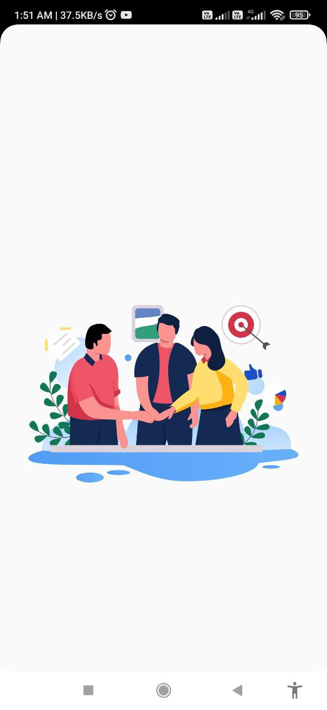

-  **Login Screen :**

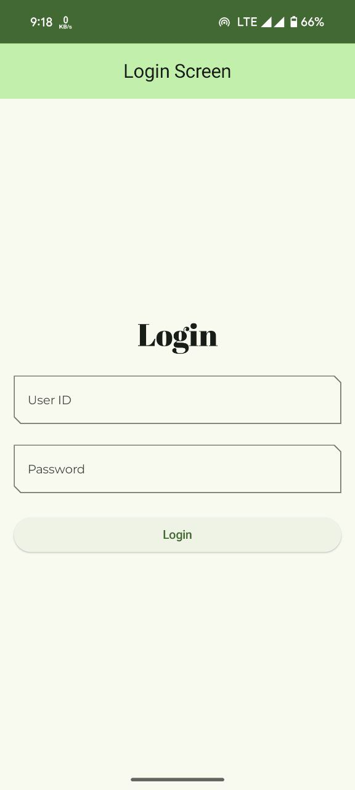

- **Admin Login Screen :**

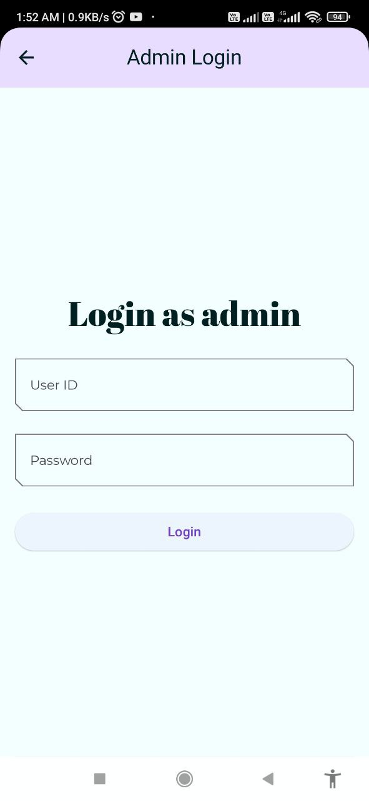

-  **Manager Login Screen :**

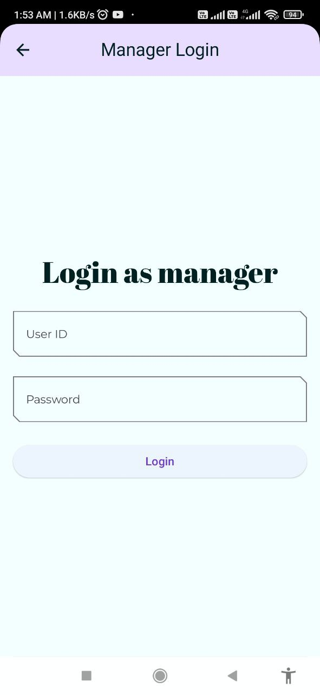

-  **Employee Login Screen :**

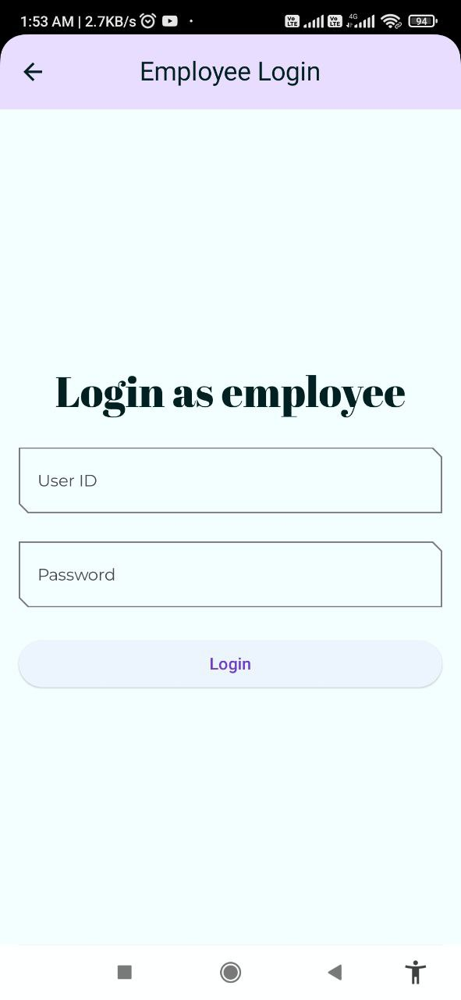

- **Admin DashBoard Screen**

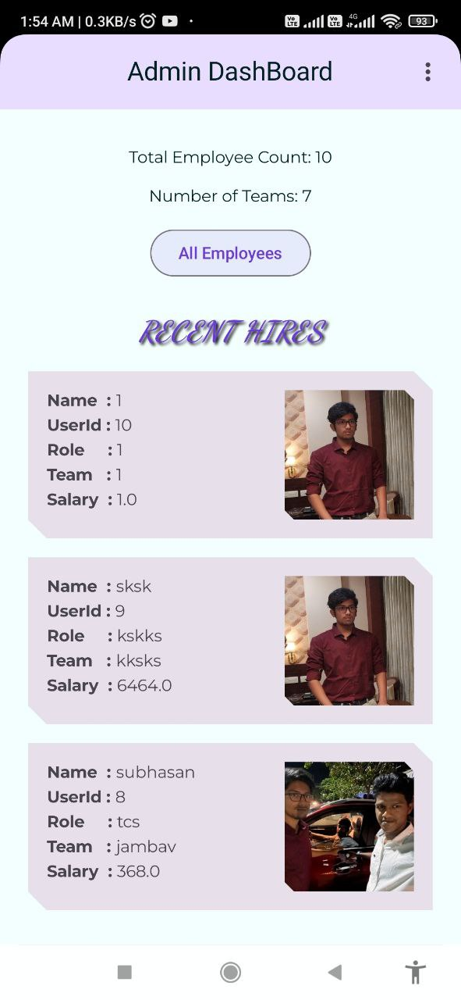

- **Manager DashBoard Screen :**

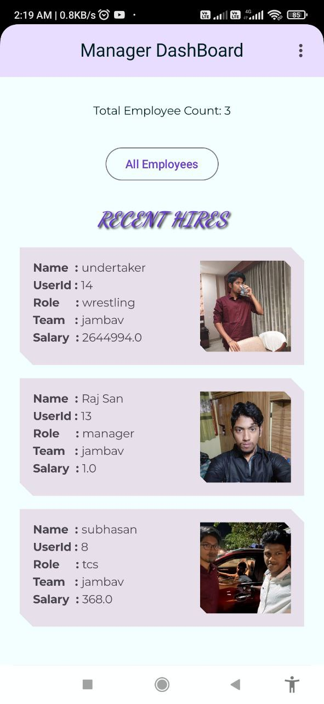

- **Admin Listing Screen :**

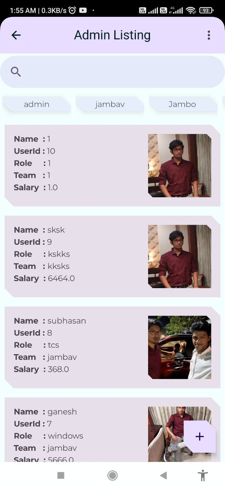

- **Manager Listing Screen :**

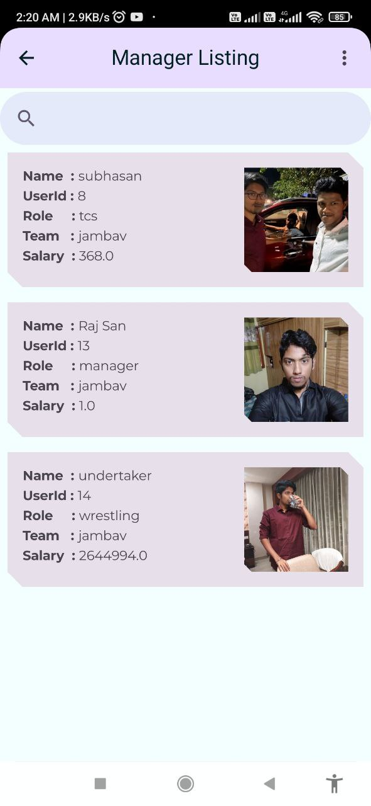

- **Employee Add Screen :**

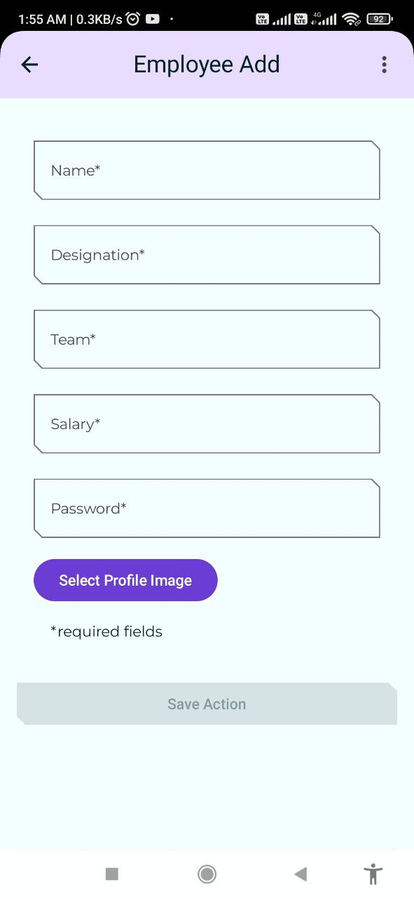

- **Employee Delete Screen :**

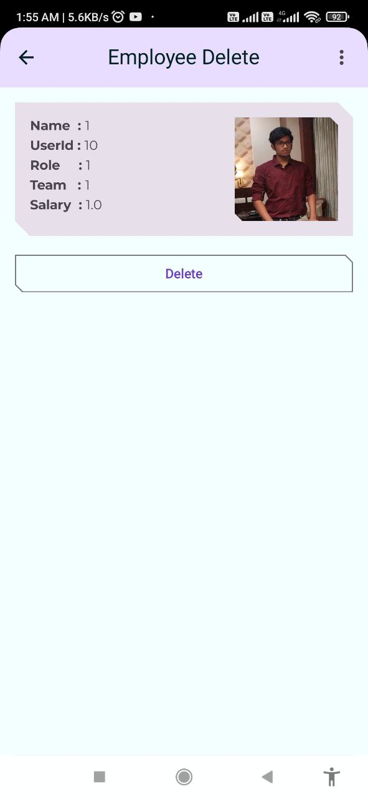

- **LogOut DropDown Menu :**

